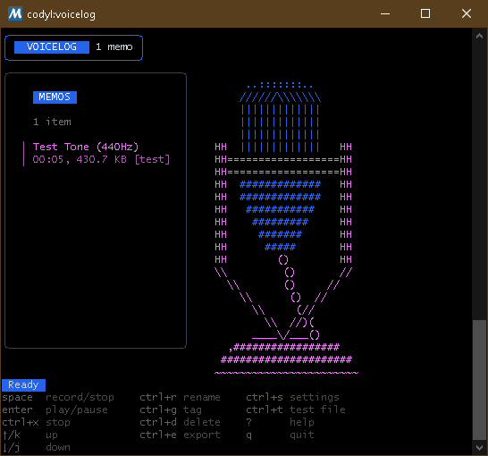
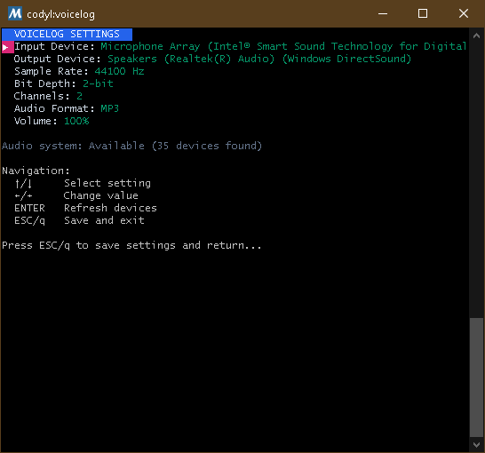

# VoiceLog

[](https://goreportcard.com/report/github.com/Cod-e-Codes/voicelog)
[](https://github.com/Cod-e-Codes/voicelog/actions/workflows/ci.yml)

A terminal-based voice memo application built with Go and Bubble Tea.

**Current Version: v1.0.6** - Latest release with automated Windows and Linux builds.

## Screenshots

### Main Screen
The main interface showing the memo list, ASCII art speaker visualization, and help information.



### Settings Screen
Audio configuration interface displaying hardware/audio settings, available devices, and help.



## Features

### Audio Recording and Playback
- Record audio using PortAudio
- Playback with real-time controls
- WAV file format support
- Configurable audio devices and settings
- Test tone generation (440Hz sine wave)

### Memo Management
- List view with navigation
- Rename memos
- Add tags for organization
- Delete memos
- Export memos to Downloads folder

### User Interface
- Terminal user interface using Bubble Tea
- Keyboard navigation
- Settings screen for audio configuration
- Help screen with keybindings
- ASCII art speaker visualization with two-tone coloring
- Professional color scheme with rounded borders

## Installation

### Pre-built Releases

Download the latest release from [GitHub Releases](https://github.com/Cod-e-Codes/voicelog/releases):

- **Windows (amd64)**: `voicelog-v1.0.6-windows-amd64.zip`
- **Linux (amd64)**: `voicelog-v1.0.6-linux-amd64.tar.gz`

#### Windows Installation
1. Download `voicelog-v1.0.6-windows-amd64.zip`
2. Extract the archive
3. Run `voicelog-windows-amd64.exe`

#### Linux Installation
1. Download `voicelog-v1.0.6-linux-amd64.tar.gz`
2. Extract: `tar -xzf voicelog-v1.0.6-linux-amd64.tar.gz`
3. Install PortAudio: `sudo apt-get install libportaudio2`
4. Run: `./voicelog-linux-amd64`

### Build from Source

#### Prerequisites
- Go 1.25 or later
- PortAudio development libraries

#### Windows (MSYS2)
```bash
pacman -S mingw-w64-x86_64-portaudio
```

#### Linux (Ubuntu/Debian)
```bash
sudo apt-get install libportaudio2 portaudio19-dev
```

#### Build and Run
```bash
# Clone the repository
git clone https://github.com/Cod-e-Codes/voicelog.git
cd voicelog

# Download dependencies
go mod download

# Build the binary
go build -o voicelog main.go

# Run
./voicelog
```

## Usage

### Keybindings

| Key | Action |
|-----|---------|
| `SPACE` | Start/Stop recording |
| `ENTER` | Play/Pause selected memo |
| `↑/↓` | Navigate memo list |
| `ctrl+r` | Rename memo |
| `ctrl+g` | Add tag |
| `ctrl+d` | Delete memo |
| `ctrl+e` | Export memo |
| `ctrl+x` | Stop playback |
| `?` | Show help |
| `ctrl+s` | Settings |
| `ctrl+t` | Generate test file |
| `ESC/q` | Quit |

### Basic Operations

1. **Recording**: Press `SPACE` to start/stop recording
2. **Playback**: Select a memo and press `ENTER` to play
3. **Settings**: Press `ctrl+s` to configure audio devices
4. **Test File**: Press `ctrl+t` to generate a 5-second 440Hz test tone
5. **Export**: Press `e` to export selected memo to Downloads folder

## Configuration

Configuration is stored in `~/.voicelog/config.json` and includes:
- Audio device settings
- Sample rate and format preferences
- Memo storage path
- Keybindings

### File Structure
```
~/.voicelog/
├── config.json          # Application configuration
├── memos/               # Voice memo storage
│   ├── metadata.json    # Memo metadata
│   └── memo_*.wav       # Audio files
└── voicelog.log         # Application logs
```

## Technical Details

Built with:
- **[Bubble Tea](https://github.com/charmbracelet/bubbletea)** - TUI framework
- **[PortAudio](https://github.com/gordonklaus/portaudio)** - Audio I/O
- **Go** - Programming language

## Known Issues

### Audio Device Problems
- **WSL (Windows Subsystem for Linux)**: ALSA errors occur due to missing audio device access. WSL doesn't provide direct access to Windows audio devices.
- **Windows Standalone**: Missing `libportaudio.dll` when running the pre-built binary outside of MSYS2 environment.
- **Recording Issues**: Audio recording may not work properly in some environments, though playback and device detection work correctly.

### Workarounds
- **For WSL**: Use the Windows version instead, as WSL doesn't support direct audio device access.
- **For Windows**: Run from MSYS2 environment or ensure PortAudio libraries are properly installed.
- **For Linux**: Ensure you have proper audio device permissions and ALSA/PulseAudio configured.

## Contributing

This project is a work in progress and contributions are welcome! If you encounter issues or have improvements to suggest, please:

1. Check existing issues on GitHub
2. Create a new issue with detailed information about your environment
3. Submit pull requests for bug fixes or new features

## License

This project is licensed under the MIT License - see the [LICENSE](LICENSE) file for details.
